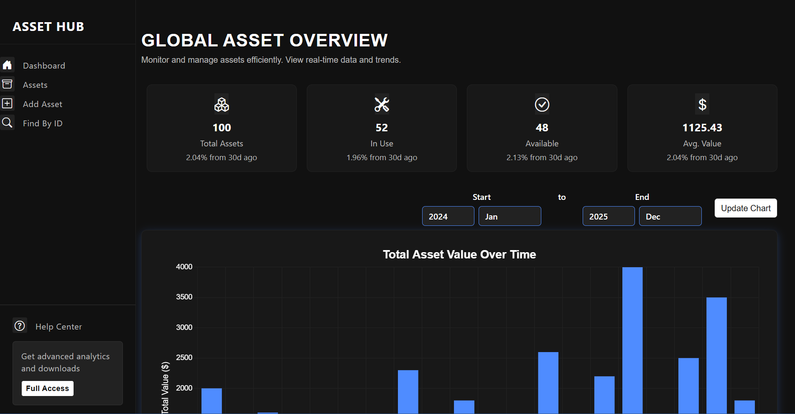
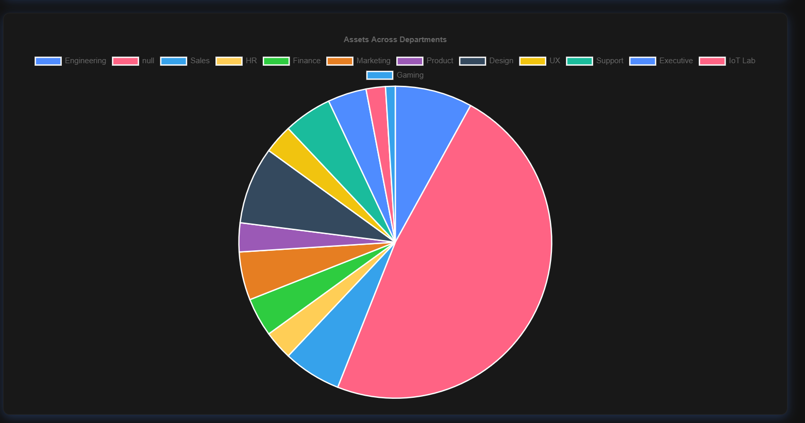
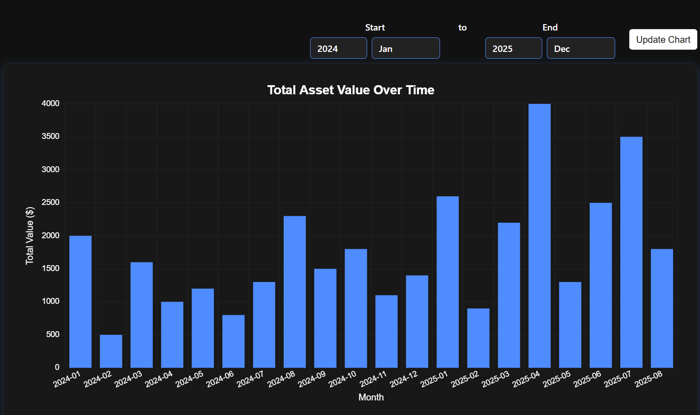
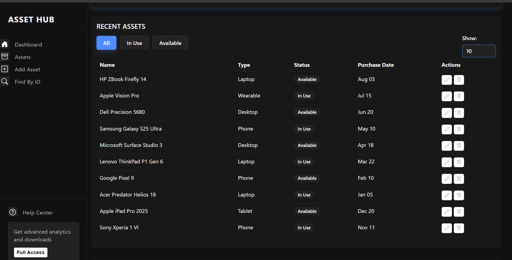
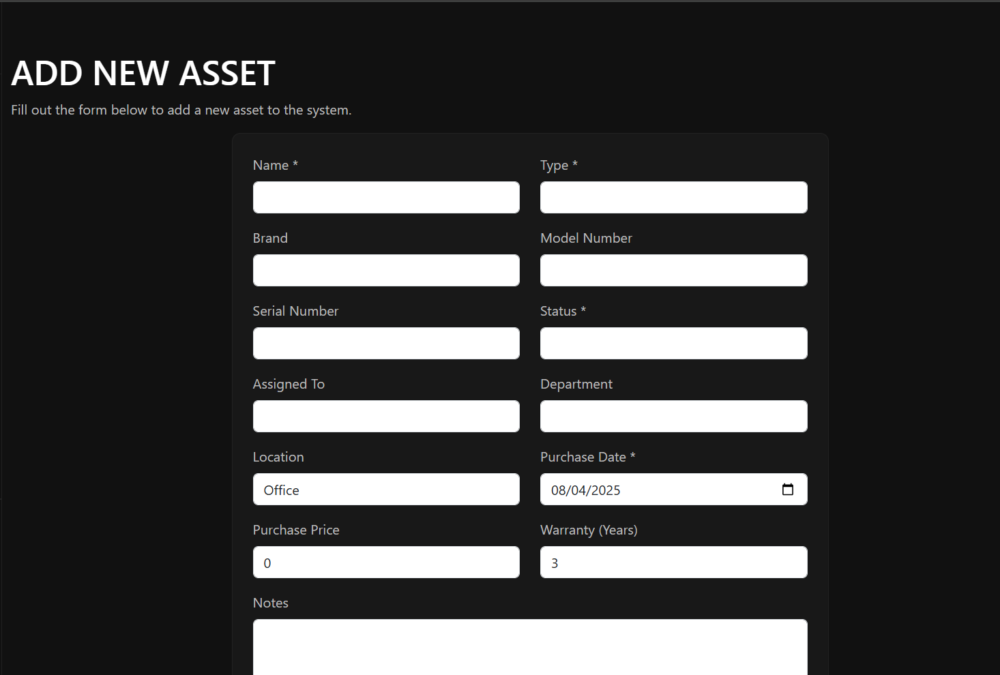

# AssetHubBlazor

A modern asset management dashboard built with Blazor (.NET 9). Monitor, manage, and analyze assets in real-time with interactive charts and tables.

## Features
- Global asset overview with summary cards

- Interactive bar and pie charts (ChartJs.Blazor)

- Filter and view recent assets
- Asset CRUD operations
- Department and status analytics

## Usage
- Use the dashboard to view asset statistics and trends.

- Add, edit, or delete assets from the asset table.

- Filter assets by status and department.
